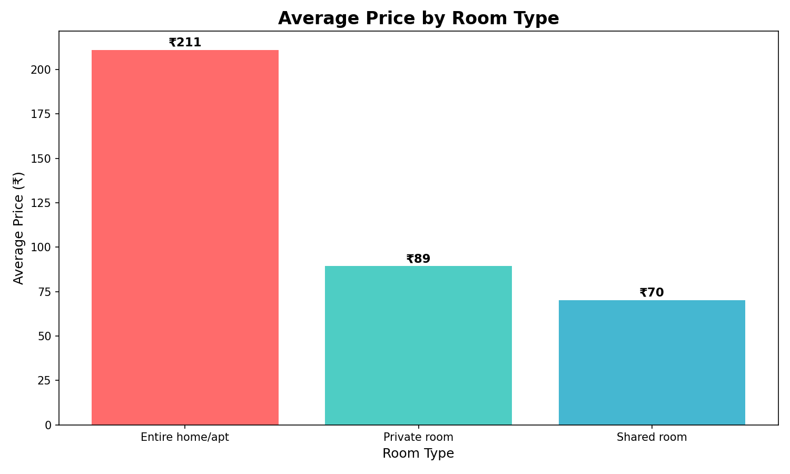
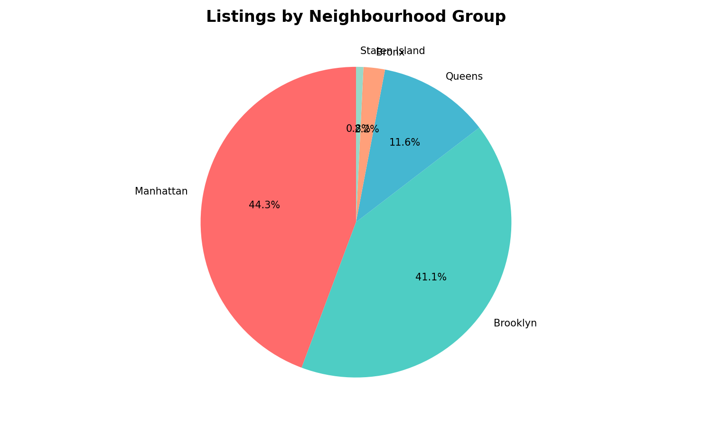
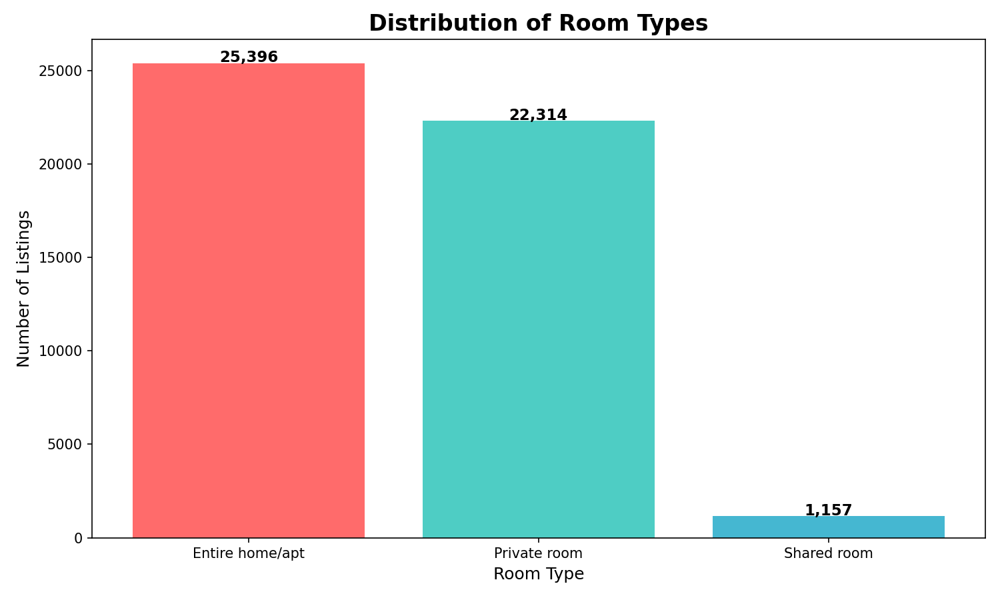
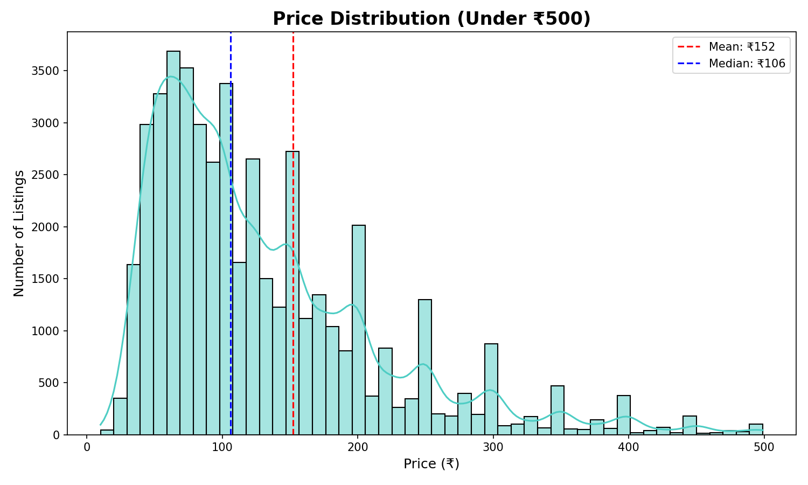
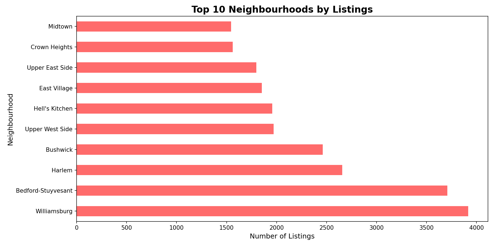
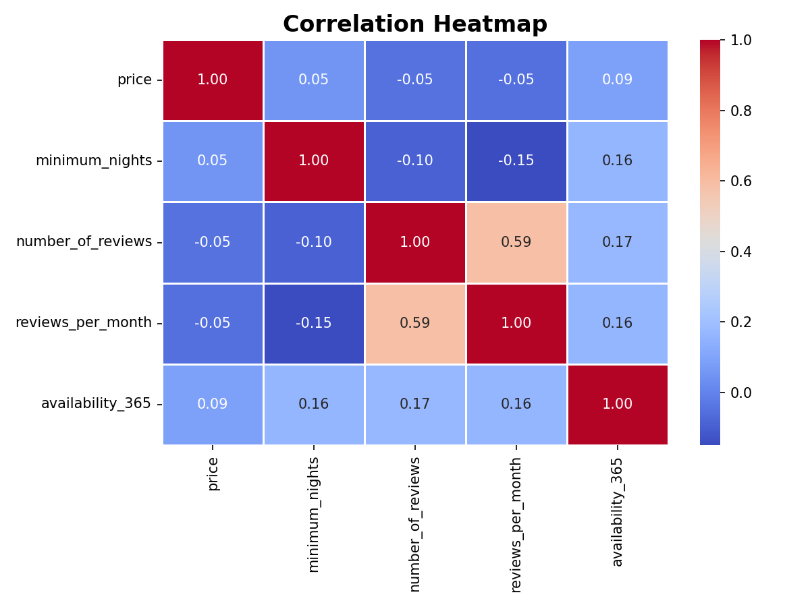

NYC Airbnb Data Cleaning Project 2
Oasis Infobyte Data Analytics Internship

📌 Project Overview
Performed **Data Cleaning** on the NYC Airbnb 2019 Dataset
to ensure data accuracy, consistency, and reliability
for further analysis and decision making.

🗂️ Dataset Info
| Detail | Value |
|--------|-------|
| Source | Kaggle |
| Dataset Name | AB_NYC_2019 |
| Rows | 48,895 |
| Columns | 16 |
| Missing Values | Found & Fixed ✅ |

Column Names:
1. **id** - Unique listing ID
2. **name** - Name of the listing
3. **host_id** - Unique host ID
4. **host_name** - Name of the host
5. **neighbourhood_group** - Area group (Manhattan, Brooklyn etc)
6. **neighbourhood** - Specific neighbourhood
7. **latitude** - Location latitude
8. **longitude** - Location longitude
9. **room_type** - Type of room
10. **price** - Price per night ($)
11. **minimum_nights** - Minimum nights required
12. **number_of_reviews** - Total reviews count
13. **last_review** - Date of last review
14. **reviews_per_month** - Monthly review count
15. **calculated_host_listings_count** - Host total listings
16. **availability_365** - Days available per year

---

🛠️ Technologies Used
| Tool | Purpose |
|------|---------|
| Python | Programming Language |
| Pandas | Data Cleaning & Manipulation |
| NumPy | Numerical Operations |
| Matplotlib | Data Visualization |
| Seaborn | Advanced Visualization |
| Google Colab | Online Coding Platform |

---

🧹 Data Cleaning Steps Performed

Step 1 - Data Loading
- Loaded CSV file with 48,895 rows
- Checked shape, columns and data types

Step 2 - Missing Values Found
| Column | Missing Values |
|--------|---------------|
| name | 16 |
| host_name | 21 |
| last_review | 10,052 |
| reviews_per_month | 10,052 |

Step 3 - Missing Values Fixed
- Filled missing **name** with 'Unknown'
- Filled missing **host_name** with 'Unknown'
- Filled missing **reviews_per_month** with 0
- Filled missing **last_review** with 'No Review'

Step 4 - Duplicate Removal
- Checked for duplicate rows
- Removed all duplicate entries

Step 5 - Invalid Data Removed
- Removed listings where price = $0
- Removed extreme price outliers above $10,000
- Removed minimum_nights above 365 days

Step 6 - Final Verification
- Zero missing values after cleaning ✅
- All data types correct ✅
- Clean dataset ready for analysis ✅

---

📊 Analysis & Visualizations

6 Charts Created:
| Chart | Description |
|-------|-------------|
| Chart 1 | Average Price by Room Type |
| Chart 2 | Listings by Neighbourhood Group |
| Chart 3 | Distribution of Room Types |
| Chart 4 | Price Distribution (Under $500) |
| Chart 5 | Top 10 Neighbourhoods by Listings |
| Chart 6 | Correlation Heatmap |

---

📈 Key Findings
| # | Finding |
|---|---------|
| 1 | Total Listings Analyzed = 48,895 |
| 2 | Manhattan = Most Popular Area |
| 3 | Entire Home/Apt = Most Expensive |
| 4 | Private Room = Most Common Type |
| 5 | Average Price = $152 per night |
| 6 | Brooklyn = 2nd Most Popular Area |

---

Business Recommendations
1. **Invest in Manhattan** - Highest demand and listings
2. **Entire Home/Apt** generates maximum revenue
3. **Price around $152** for competitive listing
4. **Get more reviews** to increase booking rate
5. **Increase availability** for better search ranking

---
📂 Repository Files
| File Name | Description |
|-----------|-------------|
| `NYC_Airbnb_Cleaning.ipynb` | Main Python Notebook |
| `AB_NYC_2019.csv` | Original Dataset |
| `chart1_price_by_room.png` | Price by Room Type |
| `chart2_neighbourhood.png` | Neighbourhood Distribution |
| `chart3_room_type.png` | Room Type Distribution |
| `chart4_price_dist.png` | Price Distribution |
| `chart5_top_neighbourhoods.png` | Top 10 Neighbourhoods |
| `chart6_heatmap.png` | Correlation Heatmap |

---

🚀 How to Run
1. Open `NYC_Airbnb_Cleaning.ipynb` in Google Colab
2. Upload `AB_NYC_2019.csv` to Colab files
3. Run all cells in order
4. All charts will be generated automatically!

---

📸 Project Charts

### Chart 1 - Price by Room Type

### Chart 2 - Neighbourhood Distribution

### Chart 3 - Room Type Distribution

### Chart 4 - Price Distribution

### Chart 5 - Top 10 Neighbourhoods

### Chart 6 - Correlation Heatmap

---

## 👨‍💻 About Me
- Name: Miruthu Jai
- Internship: Oasis Infobyte Data Analytics
- LinkedIn: https://www.linkedin.com/in/miruthujais/
- GitHub: https://github.com/miruthujai)

---
🏷️ Tags
`#oasisinfobyte` `#oasisinfobytefamily` `#internship`
`#python` `#datacleaning` `#datanalytics` `#pandas`
`#matplotlib` `#seaborn` `#datascience` `#NYC` `#airbnb`
